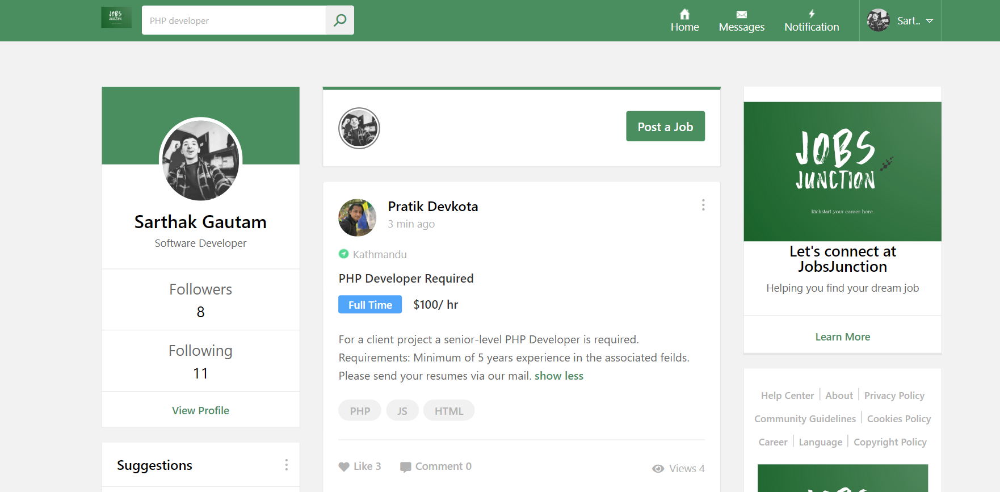

# JobJunction
JobJunction is a Full Stack web application designed via leveraging features of MERN Stack.
JobJunction is a  platform designed for professional networking and job searching. It allows users to create detailed profiles, connect with industry professionals, apply for job opportunities, and engage with content in their field.
Full Stack  Web Development via MERN Stack.



 ## Basic overview of App Structure.

```
root/
├── node_modules/             # External libraries and dependencies
├── public/                   # Public assets
│   ├── css/                  # Global CSS styles
│   ├── fonts/                # Custom fonts
│   ├── images/               # Images used in the app
│   ├── js/                   # External JavaScript libraries
│   ├── webfonts/             # Icon fonts (e.g., Font Awesome)
│   ├── index.html            # Main HTML file (entry point for React)
│   ├── manifest.json         # PWA configuration
│   ├── robots.txt            # SEO configuration
|
├── src/                      # Application logic and React
│   ├── components/
│   │   ├── common/ 
│   │   │   └── Header/
│   │   │       ├── index.js           # Combines header components
│   │   │       ├── logo.js            # Logo display component
│   │   │       ├── menu.js            # Header menu navigation
│   │   │       ├── nav.js             # Navigation bar within header
│   │   │       ├── searchbar.js       # Search functionality in header
│   │   │       ├── useraccount.js     # User account/profile section in header
│   │   │ 
│   │   ├── Pages/
│   │   │   ├── home/
│   │   │   │   ├── main/              
│   │   │   │   │   ├── leftside/                 
│   │   │   │   │   │   ├── suggestions/
│   │   │   │   │   │   │   └── index.js           # Suggested connections or groups for the user
│   │   │   │   │   │   ├── userdata/
│   │   │   │   │   │   │   └── index.js           # Displays basic user profile information
│   │   │   │   │   ├── middle/                   
│   │   │   │   │   │   ├── newpost.js             # Component for creating new posts
│   │   │   │   │   │   ├── postlist/
│   │   │   │   │   │   │   ├── post/
│   │   │   │   │   │   │   │   ├── commentssec.js # Manages comments for a post
│   │   │   │   │   │   │   │   └── index.js       # Displays a single post
│   │   │   │   │   │   │   └── index.js           # Combines posts and renders the post list
│   │   │   │   │   ├── rightside/                
│   │   │   │   │   │   ├── about.js               # Displays information about the app or user
│   │   │   │   │   │   ├── links.js               # Renders useful links for the user
│   │   │   │   │   │   └── index.js               # Combines right side components (about, links)
│   │   │   │   ├── chatbox.js                     # Embedded chat feature on home page
│   │   │   │   └── index.js                       # Combines home page components
│   │   │   ├── login/
│   │   │   │   ├── companyinfo.js                 # Shows company/app information on the login page
│   │   │   │   ├── index.js                       # Combines login-related components (signin, signup)
│   │   │   │   ├── signin.js                      # Handles the user sign-in form
│   │   │   │   ├── signup.js                      # Handles the user sign-up form
│   │   │   |
│   ├── config/                                    # App configurations (e.g., API URLs)
│   ├── App.css                                    # Styles for App component
│   ├── App.js                                     # Main component of the React app
│   ├── App.test.js                                # Test file for App.js
│   ├── index.css                                  # Global styles for the app
│   ├── index.js                                   # Entry point for React (ReactDOM renders App here)
│   ├── setupTests.js                              # Test environment setup

```

## Installation Instructions

1. CLone the repository 
```bash
git clone https://github.com/imSarthakGautam/JobsJunction-FE.git
```

2. Navigate to project director
```
cd lec-jobs-fee
```

3. Install dependencies
```
npm install
```

## Usage Guide

To start development server
```
npm start
```
